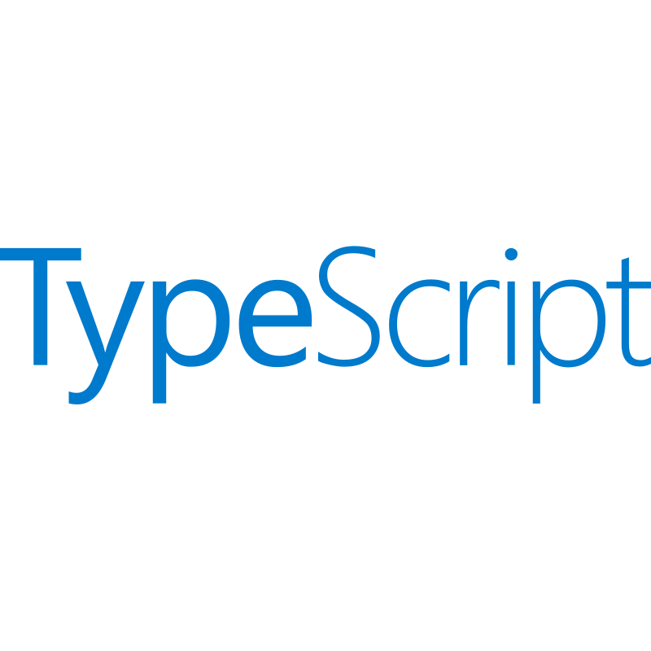

  

<h2 align="center"><kbd style="font-size: 1.25em;">Cyber-Physical Systems (CPS / ICS / IoT) Security Researcher</kbd></h2>

  <a href="mailto:anrik.dev@gmail.com">📫 <b>anrik.dev@gmail.com</b></a>

---

### 🔬 Core Focus
* **CPS & Offensive Security:** Network analysis, vulnerability discovery, `0-day` research, `Red Teaming`, `OSINT`, and forensics.
* **AI & Anomaly Detection:** Pattern recognition in technological data via `Machine Learning`, `NLP`, and secure `LLM integration`.
* **Tool Development:** Engineering custom automation software and tools for information analysis and threat simulation.

---

### 💻 Stack & Tools

<table>
  <tr>
    <td align="center" valign="middle"></td>
    <td align="center" valign="middle"></td>
    <td align="center" valign="middle"></td>
    <td align="center" valign="middle"></td>
    <td align="center" valign="middle"></td>
    <td align="center" valign="middle"></td>
    <td align="center" valign="middle"></td>
    <td align="center" valign="middle"></td>
    <td align="center" valign="middle"></td>
  </tr>
</table>

---

### 🤝 Connect:

